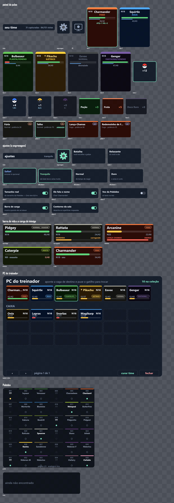
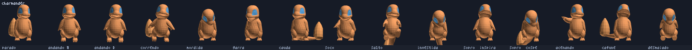
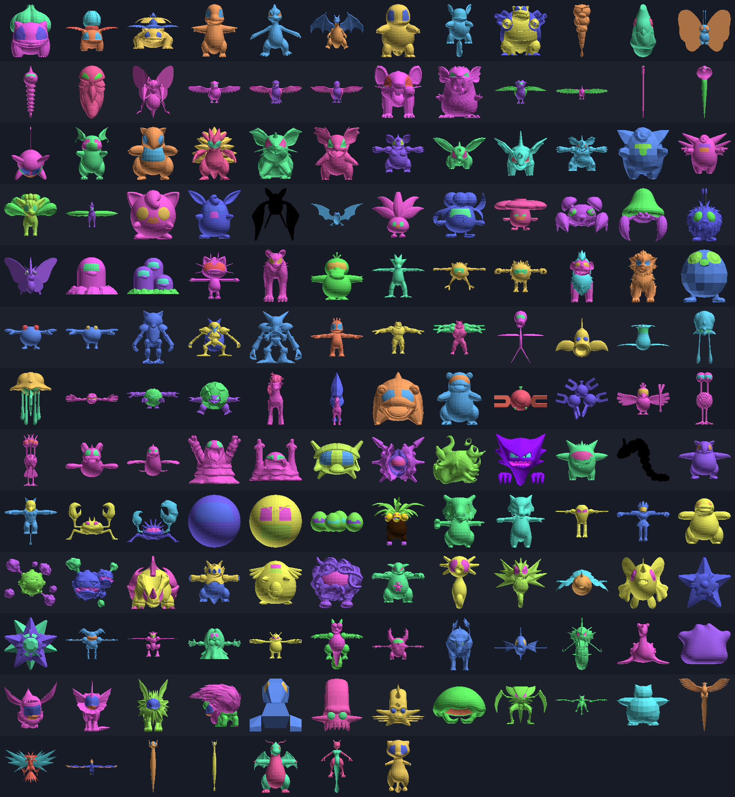

# Critter Quest

Os **151 Pokémon da primeira geração**, em modelo 3D de verdade, soltos no seu
quarto — no seu chão, em cima da sua mesa — pelo passthrough do Meta Quest 3.
Você **solta o seu numa batalha**, enfraquece o selvagem e então **arremessa a
pokébola com o braço**, com a força e a direção reais do movimento.

Roda em WebXR: é uma página web. Não precisa de Unity, de sideload nem de conta
de desenvolvedor para jogar.

> **Sobre direitos.** Pokémon é da Nintendo / Creatures / Game Freak. Isto é um
> fan game pessoal, sem fins lucrativos e fora de qualquer loja. Os modelos não
> estão neste repositório: são baixados na hora do build de
> [Pokemon-3D-api/assets](https://github.com/Pokemon-3D-api/assets), e os dados
> da Pokédex vêm da [PokeAPI](https://pokeapi.co/).

## Rodando no Quest

Precisa de duas coisas ligadas ao mesmo tempo: o servidor nesta máquina e o
encaminhamento da porta para o headset.

**Terminal 1** — sobe o servidor. Na primeira vez ele baixa os 54 MB de
modelos, o que leva alguns minutos; depois é instantâneo.

```bash
npm install
npm run dev
```

**Terminal 2** — liga o headset (cabo USB, com a depuração já autorizada):

```bash
npm run quest
```

Aí, no Quest: abra o navegador, vá em **http://localhost:5173** e toque em
*entrar em realidade mista*.

O `adb reverse` é o que faz `localhost` no headset apontar para esta máquina.
Isso importa porque o WebXR só funciona em contexto seguro, e `localhost` já
conta como seguro — sem certificado, sem aviso.

### Sem cabo

Se o Quest estiver no mesmo Wi-Fi, dá para ir pelo IP — mas aí precisa de HTTPS:

```bash
npm run dev:https
```

e abra `https://<ip-desta-máquina>:5173` no headset. O certificado é
autoassinado, então o navegador vai pedir confirmação na primeira vez.

### Sem headset nenhum

O botão *jogar na tela* abre uma versão de mouse e teclado, para mexer no jogo
sem pôr o headset a cada mudança:

- **mouse** — olhar (clique uma vez para travar o cursor)
- **WASD** — andar
- **segurar e soltar o botão esquerdo** — carregar e arremessar
- **segurar o botão direito** — marcar no chão até onde ele deve ir
- **F** — atacar · **E** — gatilho (confirma no PC) · **Q** — trocar de Pokémon
- **P** — PC · **R** — recolher · **C** — chamar · **V** — carinho · **B** — acenar
- **1**–**4** — escolher o golpe · **N** — trocar a dificuldade
- **Y** — deixar evoluir · **U** — adiar a evolução
- **G** — fruta na mão (isca) · **H** — doce na mão; aponte para um selvagem e segure

## Controles no headset

| Ação | Controle |
|---|---|
| Pegar a pokébola | segurar o **GRIP** |
| Arremessar | **soltar o GRIP** no meio do movimento do braço |
| Mandar seu Pokémon atacar | **apontar para o alvo** e tocar o GATILHO |
| Mandar ele andar até um ponto | **segurar** o GATILHO e apontar o chão; ele vai onde você soltar — e **fica lá** |
| Recolher para a bola | apontar para ele e apertar **A** |
| Chamar de volta (desfaz o "fica aí") | **X** |
| Ligar o PC (equipe e caixa) | **Y**, ou o ícone de monitor no painel do pulso |
| Time, bolas, itens e os quatro golpes | girar o **pulso esquerdo**, como para ver as horas |
| Modo de jogo, dificuldade e opções | a **engrenagem**, no canto do painel do pulso |
| Pokédex das 151 | girar o **pulso direito** do mesmo jeito |
| Ouvir a ficha da Pokédex | **GATILHO** com a Pokédex aberta |
| Escolher / recolher / usar item | apontar com a outra mão e puxar o **GATILHO** |
| Trocar de bola | **analógico direito** para os lados |
| Virar página da Pokédex | **analógico direito**, com a Pokédex aberta |
| Deixar evoluir / adiar | **A** / **B**, com a pergunta na tela |
| Fazer carinho | **encostar a mão** na cabeça dele |
| Pegar um item na mão | **GRIP** na carta do item, no painel do pulso |
| Usar o item | **encostar** o item no seu Pokémon |
| Devolver o que está na mão | levar a mão de volta ao painel e **abrir a mão** |
| Atrair um selvagem de longe | com a isca na mão, **apontar e segurar** meio segundo |

As mãos são o modelo de referência do próprio WebXR (o `generic-hand` do
[webxr-input-profiles](https://github.com/immersive-web/webxr-input-profiles),
MIT — o mesmo arquivo que o `XRHandModelFactory` do three.js carrega), baixado
no build por `npm run maos`. Com controle, os dedos fecham conforme o gatilho e
o grip: a cadeia de ossos é montada em tempo de execução a partir da pose de
repouso e o eixo em que cada junta dobra é **medido no arquivo**, não chutado.
Com *hand tracking* ligado a mesma malha passa a seguir as suas vinte e cinco
juntas de verdade — fechar o punho faz o papel do GRIP, já que mão nua não tem
botão. Se o arquivo não estiver lá, a luva montada em código assume o lugar.

`npm run mao` desenha as duas mãos em três poses e três vistas num PNG: é como
se confere que os dedos dobram para dentro da palma sem pôr o headset.

O arco pontilhado aparece enquanto você move o braço e mostra onde a bola vai
cair. Ele some quando a mão está parada — mirar é movimento, não apontar.

## O laço do jogo

Na primeira vez, **quatro Pokémon flutuam à sua frente** — Bulbasaur,
Charmander, Squirtle e Pikachu. Aponte e puxe o gatilho para escolher o seu. Sem
alguém para lutar, capturar seria quase impossível; por isso a escolha vem antes
de tudo.

1. Um selvagem aparece no seu chão ou em cima de um móvel, com nível próprio.
2. **GRIP** pega a bola do seu parceiro (ela vem na cor do tipo dele);
   arremesse e ele entra em campo.
3. **GATILHO** manda atacar — ele escolhe sozinho o golpe mais eficaz contra
   aquele alvo. O selvagem revida.
4. Com ele quase sem vida, **GRIP** pega uma bola vazia: arremesse e capture.

Enfraquecer muda muito. Se a vida chegar a zero o selvagem fica exausto e some
em nove segundos — essa é a sua janela.

**Ganhar experiência, subir de nível e evoluir.** Quem estiver em campo ganha XP
por cada selvagem derrubado ou capturado, e capturar rende mais do que derrubar.
No nível certo o jogo **pergunta** se pode evoluir, e a transformação acontece
ali mesmo, no seu quarto. As 65 linhas evolutivas da primeira geração estão
todas lá — ver [Evoluir é uma escolha](#evoluir-é-uma-escolha).

**Brilhantes.** Qualquer uma das 151 pode vir na cor alternativa, e caçar em
cadeia melhora a chance de 1 em 409 para até 1 em 40 — ver
[a caçada em cadeia](#brilhantes-a-caçada-em-cadeia). A Pokédex marca com um
ponto dourado.

## A mochila

Quatro bolas. O multiplicador não soma na chance: ele **divide a chance de
fuga**, que é o que se sente justamente nos alvos difíceis.

| Bola | Efeito | Contra Mewtwo inteiro |
|---|---|---|
| Comum | — | 0,1% |
| Reforçada | 1,9× | 15% |
| Prisma | 3,2× | 37% |
| Lacuna | 8× | 70% |

A comum recarrega sozinha; as outras vêm de capturas bem-sucedidas, e as boas
aparecem aos pouquinhos.

E três itens, na fileira de baixo do painel:

- **Poção** — devolve metade da vida de quem está em campo.
- **Fruta** — acalma o selvagem mais próximo (desfaz o alarme que você acumulou
  chegando perto) e faz a próxima bola valer quase o dobro.
- **Doce Raro** — um nível inteiro de uma vez. Quase nunca aparece.

Item não é botão: você **pega o objeto na mão**. Feche o GRIP em cima da carta e
o frasco (ou a fruta, ou o doce) vem para a sua mão; a partir daí ele é uma
coisa que se usa **encostando no seu Pokémon**. A fruta e o doce também servem
de isca à distância — ver [a isca](#a-isca-chamar-de-longe).

Desistiu? Leve a mão de volta ao painel e abra: o item volta para a mochila sem
ter sido gasto. Vale igual para a pokébola — tirar a bola, olhar e pôr de volta
no lugar não custa bola nenhuma, porque ela só é gasta quando voa.

Nada disso precisa de mira: com o painel aberto no seu pulso, a carta mais perto
da sua mão **acende** enquanto o braço chega, e é ela que o GRIP pega.

## A batalha



### Quem apanha é quem você aponta

O jogo escolhia sozinho o selvagem mais perto do seu Pokémon, o que tirava do
jogador a decisão mais básica de uma briga. Agora o braço decide: **aponte para
o bicho e puxe o gatilho**. Um anel duplo acende no chão aos pés dele, e o alvo
**trava** — os golpes seguintes continuam nele mesmo que a sua mão saia da
linha, porque ninguém mantém o braço parado a três metros de um bicho que anda.
A trava cai sozinha quando ele desmaia, foge ou some da sala; apontar outro
troca na hora.

Sem ninguém sob a mira, o gatilho continua valendo: ele acerta o ponto da sala
para onde você está apontando — que é o que dá o que fazer no modo Relaxante.

### Vá ali — e fique

Segurar o gatilho desenha o caminho no chão; soltar manda ele ir. **Chegando,
ele fica**: passeia um palmo em volta da marca, olha para você e não volta a
andar ao seu lado até você chamar com **X**, fazer carinho nele, ou mandar ele
para outro lugar. Antes a ordem durava só a caminhada — ele chegava, caía na
regra de seguir o treinador e dava meia-volta na frente de quem tinha acabado de
mandar ele ir.

### Quatro golpes, os de verdade

Cada espécie tem o **arsenal dela**, da tabela de aprendizado por nível de
Red/Blue/Yellow (`npm run golpes` gera `src/golpes.gen.ts` da PokeAPI). São 115
golpes utilizáveis, e o que o seu Pokémon sabe **depende do nível em que ele
está**: Pikachu briga com Choque Elétrico até o nível 26 e só então ganha Choque
do Trovão; Charmander só tem Lança-Chamas a partir do 38.

A regra é a do clássico — você fica com os quatro últimos que aprendeu — com
duas correções que o jogo precisa:

- **nunca ficar sem atacar**: se os quatro últimos forem todos de status, o mais
  fraco cede lugar ao melhor golpe de dano disponível;
- **nunca ficar sem o próprio tipo**: a regra crua tirava o Choque Elétrico do
  Pikachu de nível 20, e um elétrico sem nada de elétrico na mão não parece o
  que é.

Dois dos 151 não aprendem nada que este jogo saiba representar — Abra só tem
Teleporte e Ditto só tem Transformar — e para eles há uma rede: um golpe
genérico do tipo deles no nível 1.

Os golpes vêm em três categorias, e a categoria aparece no card: **FÍS** bate
Ataque contra Defesa, **ESP** bate Ataque Especial contra Defesa Especial, e
**STA** não causa dano nenhum. Você escolhe qual sai, em qualquer modo de jogo.

### Buffs e debuffs

Os golpes de status mexem em estágios, na escala clássica de −6 a +6 (`+1` é
×1,5; `+2` é o dobro). Quatro estágios: ataque, defesa, velocidade e precisão.

A **velocidade** não muda dano nenhum — ela muda a **cadência**: de quanto em
quanto tempo o golpe sai. Agilidade encurta o seu intervalo e Jato de Teia
alonga o do inimigo. A **precisão** é o que sobrou de pontaria e esquiva, que
este jogo não tem como modelar direito: sem sistema de acerto, errar mais virou
bater mais fraco, e Jato de Areia continua valendo a vez.

Os estágios são da BRIGA, não do bicho: voltar para a bola zera tudo. Os que
estiverem ativos aparecem no card do time (`ATQ+1 VEL+2`).

### Dá tempo de reagir

O golpe do selvagem saía com 0,26 s de aviso e podia tirar metade da barra. Três
mudanças, nessa ordem de importância:

1. **A barra de carga.** Cada selvagem tem o próprio relógio, o golpe é
   escolhido no início do ciclo, e a plaquinha sobre a cabeça dele mostra o
   **nome do golpe** e a barra enchendo. Na reta final ela fica vermelha, diz
   *AGORA!*, a plaquinha pulsa e o corpo dele recua. Antes havia um contador só
   para todos os selvagens, o que impedia qualquer aviso — não dava para dizer
   de quem viria o golpe antes de sortear.
2. **Teto no dano recebido.** Nenhum golpe tira mais de 20% da vida do SEU
   Pokémon. Só do seu lado: um teto para os dois achataria a tabela de tipos, e
   foi o que aconteceu na primeira tentativa — vantagem e desvantagem caíram
   para 4,0 e 6,4 golpes, e escolher o Pokémon certo deixou de significar coisa
   alguma.
3. **Cadência pela velocidade.** Electrode ataca a cada 2,0 s e Snorlax a cada
   3,9 s. Antes eram os mesmos 2,6 s para os 151.

O resultado, medido em `npm test`:

| Dificuldade | Aviso | Ciclo mínimo | Pior caso |
|---|---|---|---|
| Tranquilo | 2,00 s | 4,0 s | aguenta 8 golpes ≈ 32 s |
| Normal | 1,40 s | 3,4 s | aguenta 6 golpes ≈ 20 s |
| Duro | 0,85 s | 2,9 s | aguenta 4 golpes ≈ 11 s |

### A engrenagem

O modo de jogo ocupava uma fileira fixa do painel do pulso, entre o título e o
time — o lugar mais nobre da tela para uma coisa que se muda uma vez por sessão.
Agora é uma **engrenagem** no canto do título: um toque abre a página de
ajustes, outro fecha. Lá dentro: modo de jogo, dificuldade e cinco interruptores —
**tamanho real**, **ele fala o nome**, voz da Pokédex, barra de carga e contorno
da sala. Tudo fica salvo no headset.

A folha de painéis acima sai de `npm run paineis`: os painéis são canvas 2D, e a
ferramenta troca o `document` por um de mentira para rasterizar o **mesmo código
de desenho** que roda no headset, sobre um fundo xadrez — que é onde se vê se o
painel fica legível por cima do seu quarto. Foi ela que pegou a pílula de tipo
estourando o card do PC e o `✦` do brilhante saindo como retângulo vazio.

## Evoluir é uma escolha

Antes a evolução acontecia sozinha e em silêncio: subia de nível, a espécie
trocava no mesmo quadro e um texto avisava que já era. Duas coisas erradas
nisso — evoluir é a única decisão irreversível do jogo, e o momento mais bonito
que ele tem passava sem imagem nenhuma.

Agora o jogo **pergunta**. Aparece à sua frente *"O QUÊ? Charmander está
evoluindo!"* e ele espera: **A** deixa, **B** adia. Quem quer manter o Pikachu
Pikachu tem o direito de manter — e a recusa fica guardada no nível em que foi
feita, então a pergunta volta quando ele subir, como no jogo original.

O efeito é o clássico: o corpo **estica e encolhe** cada vez mais rápido
enquanto vai ficando branco, a luz cresce, e no estouro — quando a silhueta não
se vê — o corpo é trocado. O novo nasce branco e a cor volta. Antes e depois,
ele faz a animação de comemoração. Nada disso mexe nos materiais compartilhados:
eles são **clonados** para o exemplar que está evoluindo e descartados no fim,
senão o branco pintaria todo Charmander da sala, para sempre — o cache de
modelos não se recarrega.

E havia um buraco: a evolução só era conferida **no instante do level-up**, e
quem você captura já acima do nível nunca sobe de nível na sua mão. Um
Charmander selvagem capturado no nível 20 ficava Charmander para sempre. Agora
a checagem também roda ao entrar em campo.

## Brilhantes: a caçada em cadeia

A chance base é de **um em 409**, como na geração VI em diante — na prática,
nunca. Duas coisas melhoram isso, e as duas premiam insistência:

- **A corrente.** Encontrar a mesma espécie várias vezes seguidas aumenta a
  chance, e a espécie da corrente tem **três vezes mais peso** no próximo
  sorteio — sem esse empurrão a cadeia nunca passaria de dois ou três por acaso,
  e a caçada não existiria na prática. Um canto da casa onde o mesmo bicho
  continua aparecendo vira um lugar em que vale a pena ficar.
- **O Amuleto Brilhante**, que chega sozinho quando a Pokédex passa de cinquenta
  espécies e vale para sempre.

A conta é em **bilhetes**, não em porcentagem somada — é assim que o jogo
original faz, e é o que mantém a curva suave perto do teto:

| Corrente | Chance | Com amuleto |
|---|---|---|
| 0 | 1 em 409 | 1 em 102 |
| 5 | 1 em 205 | 1 em 82 |
| 10 | 1 em 136 | 1 em 68 |
| 20 | 1 em 82 | 1 em 51 |
| 40 | 1 em 45 | 1 em 40 |

O teto é 1 em 40: sem ele, uma corrente longa transformaria brilhante em rotina,
e a raridade **é** o conteúdo. A corrente vale só para a sessão — salvá-la
deixaria você abrir o jogo já com quarenta elos, que é o contrário da ideia. Ela
aparece no painel do pulso a partir do terceiro elo, com a chance do momento.

**As 151 podem ser brilhantes.** Sessenta e uma têm o arquivo `<num>s.glb` com
as cores alternativas de verdade; as outras noventa ganham uma **pintura em
tempo de execução** — matiz girado, saturação e brilho puxados para cima, e um
tom de ouro no emissivo. Não é a paleta oficial e não tenta ser: o que um
brilhante precisa entregar é *ser visivelmente outro* à primeira vista. Antes,
noventa espécies simplesmente não podiam ser brilhantes e não havia como o
jogador descobrir quais — ele só nunca via.

## O quarto, mapeado enquanto você anda

O jogo não acontece em volta do ponto onde você entrou. Ele acontece **onde você
está**, e o mapa cresce a cada passo — dá para caminhar até o outro cômodo e
encontrar coisa nova lá.

Três fontes se **somam**, em vez de se substituírem:

1. **Os planos do Space Setup** (`plane-detection`) — chão, mesa, sofá, cama,
   com rótulo semântico. É o que põe um Pokémon em cima da sua mesa em vez de no
   chão na frente dela.
2. **O chão sob os seus pés** (`hit-test`) — um raio apontado para BAIXO a
   partir da cabeça, lido três vezes por segundo. Cada passo carimba a célula de
   80 cm onde você está, com a altura medida ali. É isto que faz o mapa crescer,
   e é o que acerta o degrau e o tapete.
3. **Um piso que te acompanha**, enquanto o aparelho não der nenhuma das duas.

Somar importa: `detectedPlanes` é o conjunto dos planos que o runtime rastreia
**agora**, e ele encolhe quando você vira as costas. A versão anterior trocava a
lista inteira a cada leitura e caía num quadrado de 4,4 m fixo na **origem da
sessão** — daí o sintoma no headset, de tudo acontecer em volta de onde você
entrou. Plano é estático no mundo, então o que se viu uma vez se guarda.

O contador de **superfícies mapeadas** aparece no painel do pulso: é como se vê,
de dentro do headset, que o mapeamento está funcionando.

Duas consequências práticas:

- **Nascer perto de você.** O sorteio do ponto de spawn só considera superfícies
  dentro do alcance, e a faixa foi aberta para 5,5 m — um bicho a cinco metros é
  um convite para caminhar até ele. Quem fica mais de 9 m para trás vai embora
  sozinho e abre vaga para outro nascer à frente.
- **Apontar para a mesa é apontar para a mesa.** A marca do comando de andar
  testa o raio contra cada superfície conhecida e fica com a mais próxima; o
  Pokémon sobe no móvel em rampa, ao longo do percurso.

## A isca: chamar de longe

Distância era um problema de mão única. O selvagem nasce longe, passeia em volta
da âncora dele, e o único jeito de encurtar a distância — andar até lá — é o
mesmo que aumenta o alarme e faz ele fugir.

Agora a fruta e o doce podem ir **para a sua mão**: com o painel do pulso
aberto, o **GRIP** em cima da carta pega o item (o **GATILHO** continua usando na
hora, como antes). Com a isca na mão, **aponte para um selvagem e segure meio
segundo** — um rastro de pontinhos corre da fruta até ele e ele vem.

Andando, ou **flutuando**, conforme o bicho. Quem paira não pula: toda a
locomoção deste jogo é uma sucessão de pulinhos com gravidade, o que faz um
Charmander parecer um Charmander e um Gastly parecer quebrado. Trinta e poucas
espécies têm altura de voo declarada em `src/species.ts` — a lista é à mão porque
o tipo não serve: Pidgey é voador e vive no chão, enquanto Magnemite é
elétrico/aço e levita.

O item só é **gasto quando alguém vem**: apontar para o vazio não custa nada. A
fruta ainda vale o bônus de sempre para a próxima bola, o que faz atrair e
capturar virarem um movimento só; o doce chama de quase o dobro da distância e
traz o bicho completamente manso.

## O PC

**Y** liga o PC — ou o ícone de monitor no canto esquerdo do painel do pulso,
que é onde a mão já está quando se pensa em mexer na equipe. Ele não é mais um painel de pulso: aparece à sua frente e
**fica onde apareceu**, porque reorganizar a coleção é tarefa de dois toques por
bicho com os dois lados à vista, e fazer isso num painel de vinte centímetros
pendurado no braço que aponta seria brigar com o próprio painel. Dá para andar
para trás e ver tudo, ou chegar perto e ler.

A equipe é a fileira de cima e a caixa é a grade de baixo. Aponte e puxe o
gatilho para **pegar**; aponte a vaga de destino e puxe de novo para **trocar**.
Por baixo não há duas listas: "time" são as seis primeiras posições de uma lista
só, e é por isso que trocar a posição 2 com a 9 tira um do time e põe outro numa
escrita só, sem estado para manter em sincronia.

## A voz da Pokédex

Com a Pokédex aberta, o **gatilho lê a ficha em voz alta, em português**. Os
quatro iniciais têm narração gravada — cerca de meio minuto cada; quem não tem
responde com o próprio grito.

A voz é **arquivo, não `speechSynthesis`**. A API do navegador seria de graça e
sem nenhum megabyte no pacote, mas ela não sintetiza nada: pede a voz ao sistema.
No Android — e portanto no Quest — isso significa um motor de TTS instalado, e o
headset não traz nenhum. Numa aba do Chrome no PC funciona; no headset, que é
onde o jogo roda, a chamada volta sem som e sem erro, que é o pior dos dois
mundos. Então a narração é gravada em build (`npm run narracao`) e vem como MP3
em `public/voz/` — o que também deixa a Pokédex falar com a PWA offline.

## Som

### Os gritos são os oficiais

Os 151 gritos vêm do repositório de áudio da **PokeAPI** — a mesma fonte dos
dados da Pokédex e dos golpes. São 2 MB de `.ogg`, baixados no build como os
modelos (`npm run gritos`) e não versionados. `-- --legacy` troca pelos bipes de
oito bits de Red/Blue.

Uma coisa que vale dizer sem rodeio: **o grito do jogo não é a voz do desenho**.
O Charmander dos jogos guincha; quem fala "Charmander" é o dublador do anime, e
isso não existe em fonte estruturada nenhuma — nem poderia ser baixado de uma.

### Ele fala o próprio nome

Por isso as 151 falas são **gravadas** (`npm run vozes`, 2,4 MB de MP3, o mesmo
TTS da narração da Pokédex): "Char! Charmander!", "Pika! Pika pi!", "Bulba!
Bulbasaur!". Quem tem jeito consagrado está numa tabela à mão; o resto sai da
regra — o bicho diz o começo do próprio nome e depois o nome inteiro.

Uma voz só seriam 151 bichos com a mesma garganta, então o **tom** vem do jogo:
cada espécie ganha uma velocidade de reprodução deduzida do número da Pokédex e
do peso. Caterpie sai fino e apressado, Snorlax sai grave e arrastado, e os dois
saem do mesmo arquivo — que é o truque que os jogos antigos faziam com um sample
só. O interruptor **"Ele fala o nome"** devolve o grito dos jogos a quem
preferir.

Os gritos sintetizados continuam no código como reserva: eles tocam no primeiro
encontro de cada espécie, antes de o arquivo chegar, e são o que sobra se o
download falhar.

### O resto

Tudo sintetizado na WebAudio, sem arquivo nenhum no pacote (os gritos e a
narração acima são as exceções). Os dezoito tipos de golpe caem em seis famílias sonoras,
escolhidas pelo que se REPARA numa briga de três segundos: o fogo ruge, a água
jorra, o corte assobia, a energia estala, o golpe de corpo dá um baque e o
sombrio sopra grave.

Os quatro iniciais têm **grito próprio**, e o que os distingue não é o timbre —
num headset, com passthrough e o barulho do quarto, timbre some — e sim o
contorno: quantas sílabas, se a entoação sobe ou desce, se é seco ou arrastado.
O Pikachu tem duas sílabas com a segunda mais aguda e mais curta; o Charmander,
uma raspada que desce no fim; o Squirtle gorgoleja; o Bulbasaur é grave e longo
com um repuxo para cima. Eles gritam ao sair da bola, ao atacar, ao apanhar, ao
ser capturados e quando você faz carinho.

E eles têm **efeito de assinatura** no golpe principal (`src/signature.ts`): o
lança-chamas é um cone com a cor mudando por partícula — núcleo quase branco
esfriando para laranja e morrendo vermelho —, o jato d'água é uma coluna sólida
com espuma escapando no percurso, o chicote de cipó são dois tubos que serpenteiam
até o alvo e voltam, e o choque do trovão é um tronco com duas ramificações que
piscam em estalo. O resto do elenco continua com o efeito comum por formato: um
efeito distinto por espécie seria geometria demais para o headset desenhar duas
vezes por quadro.

## Animação



Dos 151 arquivos, **dezenove trazem clipe assado e só um traz um conjunto
utilizável**: o Bulbasaur, com `walk`, `run`, `aidle`, `fight` e `ko`.
Charmander e Squirtle chegam com o esqueleto inteiro e zero clipes; o Pikachu
tem um só, o "Impactrueno". Esperar por animação que não existe deixaria os
quatro parados como estátua no meio do quarto.

Então a animação é **procedural, escrita em osso** (`src/anima.ts`), e o rig
(`src/rig.ts`) é o que a faz valer para todos: os GLB compartilham a convenção
de nomes da Game Freak — `Hips`, `Spine1`, `Head`, `LArm`, `RThigh`, `Tail1` —
mudando só o sufixo que o exportador grudou (`Head_50`, `Head_9`, `Head`) e
quais ossos existem. Casando por nome, escreve-se a passada uma vez.

Os giros são em **espaço da criatura** (+Z é a frente dela), não em eixo local
de osso: dobrar o joelho é girar em X num arquivo e em Z noutro, e escrever
contra os eixos locais daria uma animação por espécie. A conversão usa a
orientação de repouso do pai.

Há uma pose base de cada vez — parado, andando, correndo, desmaiado — e por
cima um gesto. Quem tem clipe assado usa o clipe e recebe a pose procedural por
cima com peso, o que deixa o Bulbasaur **acenar** (gesto que arquivo nenhum tem)
sem perder o andar da Game Freak. Parado, o bicho ainda olha em volta e acena
sozinho de vez em quando — é o que tira a cara de boneco.

### Um gesto por família de golpe

Todo ataque usava a mesma animação: recolhe e joga o corpo para a frente.
Funcionava como *"ele atacou"* e não dizia mais nada — uma Lambida, um Arranhão
e um Lança-Chamas eram o mesmo movimento com uma partícula diferente na frente.
Agora o **nome do golpe** escolhe o gesto, e a classificação vem junto com os
golpes em `src/golpes.gen.ts`:

| Gesto | O que o corpo faz | Golpes |
|---|---|---|
| **mordida** | pescoço estica, boca escancara e fecha no bote | Lambida, Mordida, Presa Hiper |
| **garra** | o braço sobe para fora e varre na diagonal | Arranhão, Talho, Golpes Furiosos |
| **cauda** | o tronco gira e a cauda vem no contrário, nó a nó | Chicote de Cauda, Enrolar, Surra |
| **soco** | recua com o cotovelo fechado e estica | Megassoco, Soco de Fogo, Caratê |
| **salto** | agacha, salta, desce com a perna estendida | Chute Voador, Pisão, Joelhada |
| **investida** | o corpo inteiro se joga | Investida, Cabeçada, Derrubada |
| **sopro** | **inspira arqueando para trás**, segura, e despeja | fogo, água, elétrico, gelo — todo elemental |
| **aura** | só se firma; o anel conta o resto | Rosnar, Encarar, Endurecer |

O **sopro** é o que responde por "fogo/água/elétrico": o arco para trás é a
inspiração, e é ele que separa cuspir fogo de dar uma cabeçada. Quem tem clipe
de luta no arquivo usa o clipe em qualquer família — um `fight` assado pela Game
Freak vale mais do que a pose procedural, mesmo num golpe de mordida.

Todo ataque tem a mesma espinha, **recolhe e dispara**, e o que muda é qual
parte do corpo usa esses dois números. É o que faz oito gestos diferentes terem
o mesmo peso e o mesmo tempo.

### O sinal do eixo, que custou caro

Girar em +X positivo leva +Y para +Z, e a consequência disso muda de osso para
osso: **tronco, peito e pescoço** apontam para cima, então positivo os inclina
para a FRENTE; **a cabeça** aponta para a frente, então positivo baixa o
focinho; **braços, coxas e cauda** apontam para baixo, então positivo os joga
para TRÁS. Num mesmo golpe o tronco avança com sinal positivo e o braço avança
com sinal negativo.

Confundir isso fez **todo ataque recuar no golpe em vez de avançar** — o bicho
empinava e abria a boca para o teto como quem ruge, e parecia intencional. Só
apareceu na folha de poses. A caça a esse sinal também achou a cauda do
Charmander: no andar ela acompanhava o quadril no mesmo sinal em vez de
contrabalançar, e com um terço de radiano em cada um dos três nós ela girava
setenta graus e vinha parar na frente do corpo.

Duas armadilhas dos arquivos, resolvidas no código e não à mão:

- **T-pose.** O Charmander vem de braços abertos na pose de bind. Somar animação
  em cima disso o faz passear pelo quarto como um avião. `medirTPose` olha para
  onde o braço aponta em repouso e, se for horizontal, abaixa — quem já chega de
  braço caído não ganha correção nenhuma.
- **Pose de bind inutilizável.** O Pikachu vem **deitado**: o rip conta com a
  animação dele para endireitar o bicho. A versão anterior tocava o Impactrueno
  em laço eterno, o que explicava o Pikachu permanentemente eletrocutado. Agora
  só o **primeiro quadro** do clipe é tomado emprestado como pose de descanso, e
  o golpe volta a ser golpe.

A folha de poses acima sai de `npm run poses`, e ela usa o `Rig` e o `Animador`
de verdade — não uma reimplementação. Se a imagem sair errada, é o jogo que está
errado. As duas colunas de "andando" têm de mostrar as pernas trocadas.

## Os modelos



Essa folha de contato é gerada por `npm run render`, sem navegador e sem WebGL:
decodifica os GLB, projeta e rasteriza com z-buffer. As cores não são as de
verdade — são um tom por material, só para separar as peças — porque o que essa
imagem serve para conferir é **silhueta e orientação**, e foi assim que os três
modelos tortos apareceram.

Os arquivos vêm de rips dos jogos e chegam cada um de um jeito: **de 0,01 a
629 unidades de altura**, alguns com o corpo deslocado da origem, três deles
deitados ou de costas. Nada disso é corrigido à mão no jogo. O
`tools/modelos.mjs` decodifica cada malha aqui no Node, mede a caixa envolvente
e grava um manifesto com o giro, o deslocamento e a escala de cada um — medir no
build é de graça, medir no headset custaria quadro.

A orientação é adivinhada pelos **olhos**: o centroide dos materiais de olho cai
em Z positivo em quem segue a convenção. Isso resolveu 71 modelos sozinho e
apontou os suspeitos; os três que sobraram (Charmander, Charmeleon e Pikachu)
foram achados com `node tools/folha.mjs --candidatos 25`, que desenha o bicho
sob oito giros diferentes para você escolher o certo no olho.

### Tamanho real

Por padrão os bichos entram na sala **do tamanho que a Pokédex diz**, em metros
de verdade: Diglett tem 20 cm, Charizard tem 1,70 m e olha na sua cara, e Onix
tem 8,80 m e **não cabe no seu quarto**. Não caber é o ponto — é a única coisa
que só a realidade misturada faz, e espremer tudo para dentro do sofá jogava
justamente isso fora.

Quem quiser o quarto de volta desliga **Tamanho real** na engrenagem: aí vale a
curva de compressão `0,4 · altura^0,45`, que põe todo mundo entre 24 cm e 1,1 m
preservando a ordem — Charizard continua bem maior que Charmander. Trocar o
ajuste com alguém em campo **remonta o corpo na hora**, mantendo vida, nível e
posição: você vê o bicho crescer.

As distâncias pessoais acompanham o corpo. "Pare a 80 cm do treinador" foi
escrito para bichos de meio metro; num Onix isso significaria parar com a cabeça
dentro da parede, então tudo o que é distância no `src/creature.ts` passa por uma
folga proporcional ao raio.

## O código

```
src/
  main.ts        bootstrap, sessão WebXR, loop, modo sem headset
  game.ts        o jogo: batalha, captura, XP, evolução, itens, spawn
  modelos.ts     carrega, normaliza e instancia os GLB (Draco + WebP)
  modelos.gen.ts GERADO: as medidas dos 151 modelos
  pokedex.gen.ts GERADO: tipos, stats, alturas e evoluções, da PokeAPI
  species.ts     a camada de jogo por cima dos dados: arsenal, dano, níveis, estágios
  golpes.gen.ts  GERADO: os golpes da gen 1 e quem aprende cada um, em que nível
  ajustes.ts     o que a engrenagem controla: modo, dificuldade, interruptores
  evolucao.ts    a pergunta na tela e o efeito de branco da transformação
  estilo.ts      a linguagem visual dos painéis: cores, cartões, barras, pílulas
  creature.ts    um Pokémon vivo — selvagem que foge ou parceiro que luta
  rig.ts         acha os ossos do modelo pelo nome, para a animação ser uma só
  anima.ts       a animação: andar, atacar, acenar, cafuné, olhar em volta
  state.ts       a coleção salva: exemplares com nível, e o registro da Pokédex
  menu.ts        painel do pulso: modos, time, bolas, itens e golpes
  pc.ts          o PC: trocar entre a equipe e a caixa
  gesto.ts       o giro de pulso que abre os dois painéis
  modos.ts       Batalha, Relaxante e Safari
  dexpanel.ts    a Pokédex das 151, paginada
  voz.ts         a narração da Pokédex em português (MP3 de public/voz/)
  attacks.ts     efeitos dos golpes (partículas e raio)
  signature.ts   os efeitos de assinatura dos quatro iniciais
  orb.ts         a pokébola: arremesso, quique, captura e invocação
  balls.ts       os quatro tipos de bola
  itens.ts       poção, fruta e doce raro
  room.ts        o mapa da casa: planos do Quest e o chão sondado a cada passo
  isca.ts        a fruta ou o doce na mão, e o rastro até quem está sendo chamado
  hands.ts       controles, botões, velocidade do arremesso, arco e marcador
  glove.ts       a luva branca: dedos articulados e hand tracking
  hud.ts         texto, barras de vida e painéis em canvas 2D
  starter.ts     a vitrine dos quatro iniciais
  audio.ts       todos os sons, sintetizados — inclusive os gritos
  rng.ts         aleatoriedade determinística
tools/
  pokedex.mjs    baixa a PokeAPI e gera src/pokedex.gen.ts
  modelos.mjs    baixa os GLB, mede e orienta cada um
  orientacao.mjs o giro de endireitamento, compartilhado pelas ferramentas
  folha.mjs      folha de contato dos 151, sem WebGL (npm run render)
  poses.ts       folha das poses animadas, com o rig de verdade (npm run poses)
  raster.mjs     o rasterizador que as duas folhas compartilham
  narracao.mjs   grava a voz da Pokédex em MP3 (npm run narracao)
  gritos.mjs     baixa os gritos oficiais dos 151 da PokeAPI (npm run gritos)
  golpes.mjs     baixa os golpes da PokeAPI e gera src/golpes.gen.ts
  paineis.ts     folha de contato dos painéis, rasterizada (npm run paineis)
  encaixe.mjs    confere que todo mundo encaixa no chão (npm run encaixe)
  smoke.ts       simula o jogo sem navegador (npm test)
  draco.mjs      copia o decodificador Draco do three para public/
  quest.mjs      adb reverse para o headset
```

### Comandos

```bash
npm run dev        # servidor de desenvolvimento
npm run quest      # encaminha a porta para o headset
npm test           # simula o jogo em Node: dados, batalha, captura, IA
npm run render     # folha de contato dos 151, para conferir silhueta
npm run poses      # folha das poses animadas dos iniciais
npm run mao        # folha das poses da mão, em três vistas
npm run maos       # baixa o modelo de mão do webxr-input-profiles
npm run vozes      # grava os 151 dizendo o próprio nome
npm run narracao   # grava a voz da Pokédex (só o que estiver faltando)
npm run gritos     # baixa os gritos oficiais (--legacy para os de 8 bits)
npm run paineis    # folha de contato dos painéis, para conferir a interface
npm run golpes     # regenera os golpes e as tabelas de aprendizado
npm run encaixe    # confere o encaixe de todos no chão
npm run build      # typecheck + bundle em dist/
npm run pokedex    # regenera os dados a partir da PokeAPI
npm run modelos    # baixa e remede os modelos
```

### O que os testes pegam

`npm test` roda o jogo sem navegador nenhum. Ele confere que a Pokédex fecha
consigo mesma (toda evolução aponta para alguém que existe, todo mundo tem
modelo medido), que ninguém fica maior que o quarto, que a tabela dos 18 tipos
dá 4× em Gyarados com elétrico e **zero** em Charizard com terra, que o golpe
escolhido é sempre o melhor disponível, que o ritmo da batalha fica na faixa
jogável, que enfraquecer sempre ajuda na captura e que esforço sempre resolve —
e falha se algo virar NaN, atravessar o chão ou nunca resolver.

Ele já pegou cinco problemas reais: geometria com NaN, distância medida em 3D
quando devia ser no plano, batalhas de 17 golpes, um Onix que ocupava 2,55 m do
chão e uma captura que ficava garantida cedo demais.

`npm run encaixe` é o complemento: decodifica os 151 GLB de verdade, refaz por
fora exatamente a sequência de transformações de `src/modelos.ts` e mede onde o
bicho foi parar. Hoje o pior caso tem o **pé a 0,06 mm do chão** e **0,03 mm de
desvio do centro**. É o teste que pegaria um Pokémon nascendo enterrado no
carpete — coisa que nenhum teste de lógica vê.

### Depurando ao vivo

Com o jogo aberto, o console tem `cq`:

```js
cq.info      // quadros, draw calls, triângulos, texturas, capturas
cq.jogo      // a instância do jogo
```

## Notas de performance

O Quest 3 desenha a cena **duas vezes por quadro**, a 90 Hz. Por isso o projeto
evita de propósito: refração (`transmission`), pós-processamento, sombras
grandes e redesenho de canvas a cada quadro.

Com 151 espécies, a memória virou uma preocupação nova. Duas defesas:

- **Carregamento sob demanda.** Nenhum modelo é baixado antes de ser preciso; o
  selvagem só aparece quando o GLB dele chegou. O service worker guarda o que já
  passou, então a segunda vez que você encontra um Rattata é offline.
- **Despejo por uso.** `src/modelos.ts` segura no máximo 14 modelos em memória e
  descarta o menos usado — cada espécie traz textura própria, e numa sessão longa
  dá para encontrar dezenas delas.

Se começar a engasgar, o primeiro botão a girar é o `setFramebufferScaleFactor`
em `main.ts` — baixe para `0.8`.

## Instalar como app no headset

Dá para empacotar num APK e ter o jogo na biblioteca do Quest, com ícone próprio,
abrindo direto em passthrough. O passo a passo completo está em
**[GUIA-QUEST.md](GUIA-QUEST.md)**.

O resumo: o Quest empacota PWAs via [Bubblewrap](https://developers.meta.com/horizon/documentation/web/pwa-packaging/),
e o APK é uma casca que aponta para o jogo hospedado. Por isso **é preciso
publicar o jogo num domínio HTTPS antes de empacotar** — uma PWA imersiva só
abre com os Digital Asset Links verificados, e não há como embutir os arquivos
dentro do APK.

Como o APK é só a casca, **mudar o jogo não exige reinstalar nada**: um
`npm run build` e um push bastam.

```bash
npm run icons          # gera os ícones PNG (em código, sem asset binário)
npm run pwa:check      # confere manifest, ícones, service worker e assetlinks
npm run pwa:check URL  # o mesmo, mas contra o site já publicado
npm run assetlinks -- <SHA256>   # gera o .well-known/assetlinks.json
```
