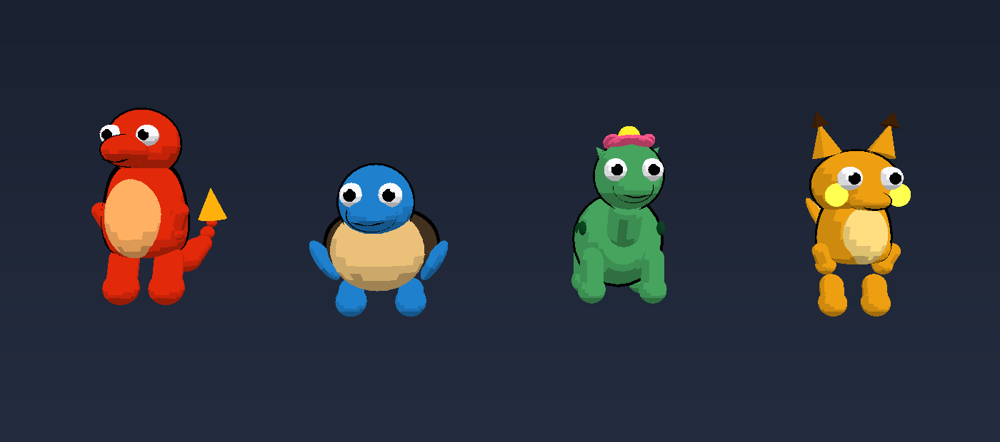

# Critter Quest

Um jogo de **capturar criaturas em realidade mista** no Meta Quest 3. Elas
aparecem no seu quarto de verdade — no seu chão, em cima da sua mesa. Você
**solta a sua numa batalha**, enfraquece a selvagem e então **arremessa a
esfera com o braço**, com a força e a direção reais do movimento.

Roda em WebXR: é uma página web. Não precisa de Unity, de sideload nem de conta
de desenvolvedor para jogar.

> As criaturas, os nomes e os golpes são originais deste projeto. O gênero de
> caçar e colecionar é livre; os personagens de outras franquias não são, e não
> há nenhum deles aqui.

## Rodando no Quest

Precisa de duas coisas ligadas ao mesmo tempo: o servidor nesta máquina e o
encaminhamento da porta para o headset.

**Terminal 1** — sobe o servidor:

```bash
npm install
npm run dev
```

**Terminal 2** — liga o headset (cabo USB, com a depuração já autorizada):

```bash
npm run quest
```

Aí, no Quest: abra o navegador, vá em **http://localhost:5173** e toque em
*entrar em realidade mista*.

O `adb reverse` é o que faz `localhost` no headset apontar para esta máquina.
Isso importa porque o WebXR só funciona em contexto seguro, e `localhost` já
conta como seguro — sem certificado, sem aviso.

### Sem cabo

Se o Quest estiver no mesmo Wi-Fi, dá para ir pelo IP — mas aí precisa de HTTPS:

```bash
npm run dev:https
```

e abra `https://<ip-desta-máquina>:5173` no headset. O certificado é
autoassinado, então o navegador vai pedir confirmação na primeira vez.

### Sem headset nenhum

O botão *jogar na tela* abre uma versão de mouse e teclado, para mexer no jogo
sem pôr o headset a cada mudança:

- **mouse** — olhar (clique uma vez para travar o cursor)
- **WASD** — andar
- **segurar e soltar o botão esquerdo** — carregar e arremessar

## Controles no headset

| Ação | Controle |
|---|---|
| Pegar a esfera | segurar o **GRIP** |
| Arremessar | **soltar o GRIP** no meio do movimento do braço |
| Mandar seu criatura atacar | **GATILHO** |
| Abrir o painel do time | virar a **palma esquerda** para cima |
| Escolher / recolher um criatura | apontar com a direita e puxar o **GATILHO** |
| Trocar de esfera | **analógico direito** para os lados |
| Escolher a inicial (só na primeira vez) | apontar e **GATILHO** |

O arco pontilhado aparece enquanto você move o braço e mostra onde a bola vai
cair. Ele some quando a mão está parada — mirar é movimento, não apontar.

## O laço do jogo

Na primeira vez, **três criaturas flutuam à sua frente**: aponte e puxe o
gatilho para escolher sua parceira. Sem alguém para lutar, capturar seria quase
impossível — por isso a escolha vem antes de tudo.

1. Uma criatura selvagem aparece no seu chão ou em cima de um móvel.
2. **GRIP** pega a esfera da sua parceira (ela vem na cor do tipo); arremesse e ela entra em campo.
3. **GATILHO** manda atacar. A selvagem revida sozinha.
4. Com ela quase sem vida, **GRIP** pega uma esfera vazia — arremesse e capture.

Enfraquecer muda muito: com vida cheia a captura fica em **33%**, quase
desmaiada passa de **80%**. Mas se a vida chegar a zero ela fica exausta e some
em nove segundos — essa é a sua janela.

## As esferas

Quatro tipos. O multiplicador não soma na chance: ele **divide a chance de
fuga**, que é o que se sente justamente nos alvos difíceis.

| Esfera | Efeito | Contra um alvo difícil e inteiro |
|---|---|---|
| Comum | — | 15% |
| Reforçada | 1,9× | 43% |
| Prisma | 3,2× | 62% |
| Lacuna | 8× | 83% |

A comum recarrega sozinha; as outras vêm de capturas bem-sucedidas, e as boas
aparecem aos pouquinhos. Troque com o **analógico direito**, ou pela fileira de
baixo do painel do time.

## As quatro criaturas



Geradas em código: não há um único modelo 3D nem textura no repositório. O
tronco é um corpo de revolução a partir de um perfil desenhado à mão — pilha de
esferas deixa degraus na silhueta, o torno não — com sombreado em degraus e
contorno preto por fora.

| Criatura | Tipo | Golpe | Vida |
|---|---|---|---|
| Fagulho | Fogo | Lufada de Brasa | 40 |
| Marolo | Água | Esguicho | 46 |
| Sementil | Planta | Folha Afiada | 47 |
| Trovisco | Elétrico | Estalo | 36 |

Os três primeiros são as opções de início. Trovisco aparece menos e resiste mais
à captura: é o que você caça, não o que ganha.

A tabela de tipos é a clássica — fogo queima planta, água apaga fogo, planta
bebe água, elétrico frita água. Com vantagem a batalha dura ~4 golpes; sem ela,
~9. Escolher quem mandar para o campo importa.

Sua coleção e sua mochila ficam salvas no headset. Quem está fora de campo se
recupera sozinha com o tempo.

## O código

```
src/
  main.ts       bootstrap, sessão WebXR, loop, modo sem headset
  game.ts       o jogo: batalha, captura, spawn, controles
  pokemon.ts    os quatro corpos, montados em geometria
  species.ts    tipos, golpes, dano, tabela de efetividade
  creature.ts   um criatura vivo — selvagem que foge ou parceiro que luta
  attacks.ts    efeitos dos golpes (partículas e o raio do Pikachu)
  orb.ts        a esfera: arremesso, quique, captura e invocação
  menu.ts       o painel do time, que abre virando a palma
  room.ts       leitura dos planos reais do Quest (chão, mesa, sofá)
  hands.ts      controles, velocidade do arremesso, arco de mira
  hud.ts        texto, barras de vida e painéis em canvas 2D
  state.ts      a coleção salva, com o HP de cada um
  audio.ts      todos os sons, sintetizados
  rng.ts        aleatoriedade determinística
tools/
  smoke.ts      simula o jogo sem navegador (npm test)
  render.ts     rasteriza os criatura num PNG, sem WebGL (npm run render)
  quest.mjs     adb reverse para o headset
```

### Comandos

```bash
npm run dev        # servidor de desenvolvimento
npm run quest      # encaminha a porta para o headset
npm test           # simula o jogo em Node: batalha, captura, IA
npm run render     # redesenha pokemon.png para conferir a silhueta
npm run build      # typecheck + bundle em dist/
```

O `npm test` roda o jogo sem navegador nenhum — combates até o nocaute em todos
os confrontos possíveis, 200 ciclos de captura, 60 segundos de companheiro
seguindo o treinador — e falha se algo virar NaN, atravessar o chão, nunca
resolver, ou se o ritmo da batalha sair da faixa jogável. Ele já pegou três
problemas reais: geometria com NaN, distância medida em 3D quando devia ser no
plano, e batalhas de 17 golpes.

O `npm run render` desenha os quatro num PNG usando um rasterizador próprio em
Node, com z-buffer e luz difusa — dá para conferir a silhueta depois de mexer na
geometria sem abrir navegador nem pôr o headset.

### Depurando ao vivo

Com o jogo aberto, o console tem `cq`:

```js
cq.info      // quadros, draw calls, triângulos, capturas
cq.jogo      // a instância do jogo
```

## Notas de performance

O Quest 3 desenha a cena **duas vezes por quadro**, a 90 Hz. Por isso o projeto
evita de propósito: refração (`transmission`), pós-processamento, sombras
grandes e redesenho de canvas a cada quadro. Se começar a engasgar, o primeiro
botão a girar é o `setFramebufferScaleFactor` em `main.ts` — baixe para `0.8`.

## Instalar como app no headset

Dá para empacotar num APK e ter o jogo na biblioteca do Quest, com ícone próprio,
abrindo direto em passthrough. O passo a passo completo está em
**[GUIA-QUEST.md](GUIA-QUEST.md)**.

O resumo: o Quest empacota PWAs via [Bubblewrap](https://developers.meta.com/horizon/documentation/web/pwa-packaging/),
e o APK é uma casca que aponta para o jogo hospedado. Por isso **é preciso
publicar o jogo num domínio HTTPS antes de empacotar** — uma PWA imersiva só
abre com os Digital Asset Links verificados, e não há como embutir os arquivos
dentro do APK.

O projeto já traz o que o empacotamento exige:

```bash
npm run icons          # gera os ícones PNG (também em código, sem asset binário)
npm run pwa:check      # confere manifest, ícones, service worker e assetlinks
npm run pwa:check URL  # o mesmo, mas contra o site já publicado
npm run assetlinks -- <SHA256>   # gera o .well-known/assetlinks.json
```
